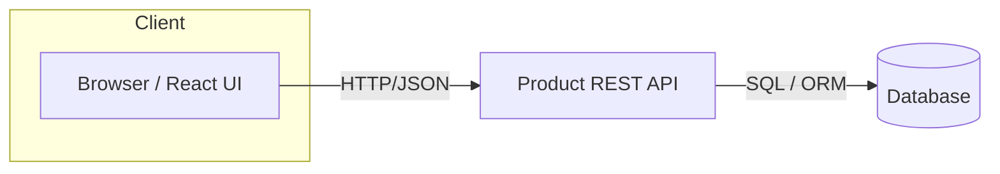

# Product CRUD App — Architecture & Design 📐

> **Purpose:** Describe the high-level system, components, data model, APIs, deployment, testing, and open decisions for the Product CRUD app.

---

## Table of Contents

- [Overview](#overview)
- [Goals & Non-Goals](#goals--non-goals)
- [System Context](#system-context)
- [Architecture Diagram](#architecture-diagram)
- [Tech Stack](#tech-stack)
- [Folder Structure](#folder-structure)
- [Data Model](#data-model)
- [API Endpoints](#api-endpoints)
- [Client Architecture](#client-architecture)
- [Testing Strategy](#testing-strategy)
- [Security & Validation](#security--validation)
- [Deployment & CI/CD](#deployment--cicd)
- [Open Questions](#open-questions)
- [Next Steps](#next-steps)

---

## Overview

A simple CRUD application for managing products. The app provides a responsive UI for listing, creating, updating, viewing, and deleting products. It's implemented as a TypeScript React front-end (Vite) and interacts with a (REST) backend API.

**Key assumptions:**

- Backend exposes a REST API for product operations (could be a mock or real service).
- The app targets modern browsers and will be deployed to a static hosting service (Vercel/Netlify) with the API hosted separately.

---

## Goals & Non-Goals

**Goals**

- Clear, maintainable architecture suitable for small teams.
- Good developer experience (TypeScript, linting, unit tests).
- Easy to extend (add search, filters, auth).

**Non-Goals**

- Not intended to be a full e-commerce platform.
- No heavy state-management framework (e.g., Redux) unless necessary.

---

## System Context

- Browser (client) <-> Product Service (REST API)
- Optional: Local storage / IndexedDB for offline caching or optimistic updates

---

## Architecture Diagram



---

## Tech Stack

- Frontend: React + TypeScript + Vite
- Styling: CSS Modules / Tailwind / plain CSS (current repo uses CSS files)
- Testing: Vitest / React Testing Library
- Linting & Formatting: ESLint, Prettier
- CI: GitHub Actions (recommended)
- Hosting: Vercel / Netlify for frontend; backend: Heroku / Cloud Run / Render / self-hosted

---

## Folder Structure (high-level)

- `src/`
  - `components/` — reusable UI components (ProductList, ProductForm)
  - `pages/` — route-level components (ProductsPage, ProductDetail)
  - `services/` — API wrappers and client code
  - `hooks/` — custom hooks (useProducts)
  - `models/` — TypeScript interfaces and types
  - `App.tsx`, `main.tsx` — app bootstrap

_Keep components small and focused; prefer composition over large monoliths._

---

## Data Model

Example Product model:

```ts
interface Product {
  id: string; // UUID
  name: string;
  description?: string;
  price: number; // cents or float (pick one and be consistent)
  inventory: number;
  createdAt: string; // ISO timestamp
  updatedAt?: string;
}
```

Validation rules:

- `name`: required, max length 255
- `price`: >= 0
- `inventory`: integer >= 0

---

## API Endpoints (REST)

- GET /api/products — list all products (query params: page, size, search)
- GET /api/products/:id — get product details
- POST /api/products — create product (body: product fields)
- PUT /api/products/:id — update product
- DELETE /api/products/:id — delete product

Responses should be standard JSON with appropriate HTTP status codes and error payloads.

---

## Client Architecture

- Routes: React Router (or simple route handling)
- State: Local component state + context for small global bits (e.g., current user), use SWR/react-query for data fetching and caching if desired.
- API Layer: `services/products.ts` that exports CRUD functions: `listProducts`, `getProduct`, `createProduct`, `updateProduct`, `deleteProduct`. Centralize fetch / error handling / auth headers here.
- UI Components: `ProductList`, `ProductCard`, `ProductForm`, `ConfirmDialog`.
- Forms: use controlled components or a lightweight library (React Hook Form) for validation and accessibility.

UX considerations:

- Add loading states and graceful error messages.
- Use optimistic updates for create/update/delete where appropriate.

---

## Testing Strategy

- Unit tests for components with React Testing Library and Vitest.
- Integration tests for the services layer, using mocked fetch / msw (mock service worker).
- Basic end-to-end tests (optional) with Playwright or Cypress for critical flows (create → view → edit → delete).

---

## Security & Validation

- Input validation on both client and server.
- Escape or sanitize user-provided content if rendered as HTML.
- Use HTTPS in production; store tokens securely (HttpOnly cookies recommended for auth).

---

## Deployment & CI/CD

- GitHub Actions:
  - Run lint, typecheck, and tests on PRs
  - Build and deploy on merge to main
- Frontend: Deploy static assets to Vercel/Netlify
- Backend: Deploy to chosen host with auto-deploy from main

---

## Open Questions

- Is there an existing backend we must integrate with or should we provide a small reference implementation?
- Should we use `react-query` or `SWR` for data fetching and cache management?
- Which format for price (cents integer or decimal float)?

---

## Next Steps ✅

1. Add `docs/ARCHITECTURE.md` to the repo (this file).
2. Create a short `docs/README.md` if more docs are needed.
3. Link the doc from the project `README.md` and add a small checklist for reviewers.
4. Optionally implement a minimal backend reference or mock server for local development.

---

If you'd like, I can: add diagrams as images, create a `docs/README.md` linking this file, or open a PR with a sample API mock. Let me know which next step to take. ✨
